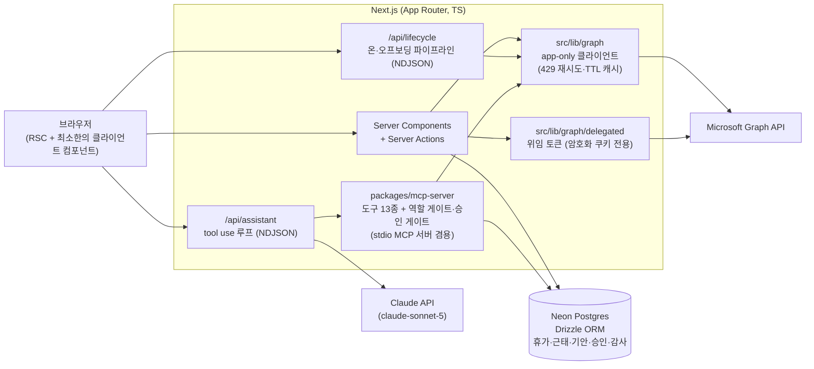
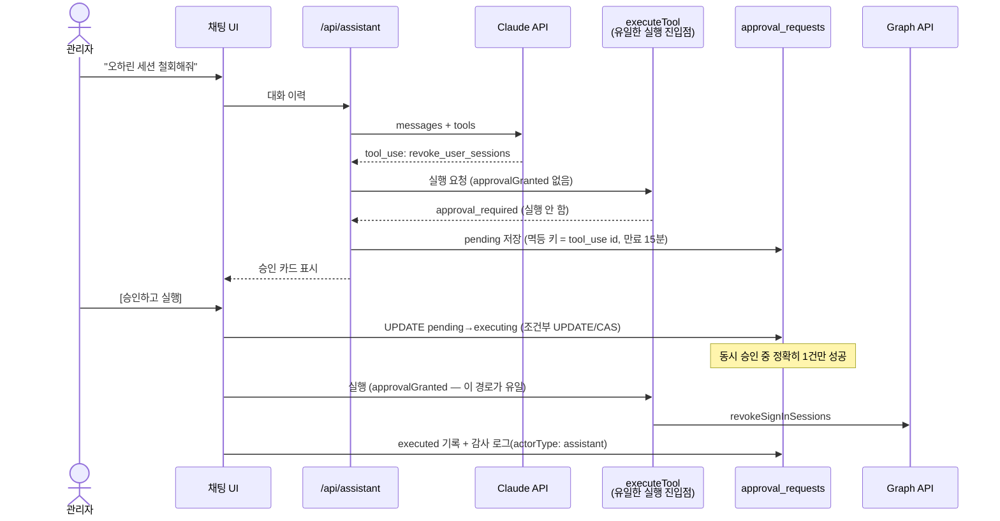

# WorkHub365

[](https://github.com/kws0109/workhub365/actions/workflows/ci.yml)

**M365 위에 얹히는 경량 그룹웨어 + 관리 자동화 (오픈소스)**

Microsoft 365를 쓰는 조직을 위한 올인원 도구입니다. 직원은 M365 계정으로 로그인해 휴가·근태·전자결재를 쓰고, IT 관리자는 온보딩/오프보딩·라이선스를 자동화하며, AI 어시스턴트가 자연어로 이 액션들을 대행합니다 — 별도 인프라 없이, 조직의 M365 인증과 데이터를 그대로 활용합니다.

> 이 프로젝트는 AI 코딩 에이전트(Claude Code) 주도의 spec-driven development로 개발되며, **개발 과정 전체(스펙, 커밋, 의사결정, 실패와 개선)를 이 리포와 [Wiki](../../wiki)에 투명하게 기록**하는 것 자체가 목표의 일부입니다. 모든 작업의 실행 프롬프트는 [docs/prompt-log.md](docs/prompt-log.md)에 남깁니다.

**개발 기간과 내 역할** — 2026-08-07~09, 커밋 79개, 8개 모듈 14화면. 코드 생성은 에이전트가 했고, 제품·스펙 결정, 다관점 병렬 리뷰 하네스 설계, 실브라우저 E2E 검증, 커밋 단위 통제는 제 몫이었습니다. 에이전트 산출물을 그대로 받지 않았다는 근거:

- [`51e7671`](../../commit/51e7671) — 리뷰 19건 지적을 반박 검증한 뒤 고유 결함 13건만 채택
- [`60a84a2`](../../commit/60a84a2) — 세 설계안이 모두 "문제없다"고 한 지점에서 페이지가 5~7분 멈추는 것을 실측으로 잡아 타임아웃 도입
- [`de4ea33`](../../commit/de4ea33) — 설계 경합·심사에서 드러난 우회 경로 4종을 규칙으로 봉쇄(2단계 결재 우회, 근무시간 폭주, 시드 롤백, DB 제약 소실)

무엇을 반려했고 왜 반려했는지가 [docs/prompt-log.md](docs/prompt-log.md)와 [docs/handoff.md](docs/handoff.md)에 남아 있습니다.

## 왜 만들었나

M365 네이티브 관리 센터는 다음이 약합니다:

- **라이선스 낭비 가시성** — 미사용/과다 할당 라이선스와 낭비 금액을 한눈에 볼 수 없음
- **오프보딩 자동화** — 차단→세션 철회→라이선스 회수→그룹 제거를 수작업으로
- **그룹웨어 기능** — 휴가/근태/전자결재 워크플로우가 아예 없음

국내 시장에는 M365 전용 관리도구가 사실상 공백입니다(CSP 리셀러와 범용 SaaS 자산관리 도구만 존재).

## 기능

| 모듈 | 설명 |
|---|---|
| 업무 포털 | 홈 대시보드(근무 상태·결재 대기·잔여 연차·52시간 게이지·M365 안읽은 메일/오늘 일정), 섹션형 사이드바 + M365 앱 런처 |
| 라이선스 대시보드 | SKU 현황, 비활성 사용자×라이선스 매트릭스, 원화 낭비 금액, 절감 추천, 단가 인라인 편집 |
| 온보딩/오프보딩 | 계정 생성→라이선스→그룹 배정 / 차단→세션 철회→회수→제거 — NDJSON 스트리밍 파이프라인, 실패 단계부터 재시도, 감사 로그 |
| 휴가 관리 | 캘린더 클릭 신청→결재선 승인→잔여 연차 차감, 팀 연차 현황, 공휴일 자동 수집(Nager.Date) |
| 근태 관리 | 출퇴근 체크(자정 넘김 지원), KST 주간 집계, 52시간 경고 게이지 |
| 기안(전자결재) | 템플릿 4종(경비/데이터 반출/휴직/구매), 자동 결재선 + 편집, 순차 결재, 회수·강제 반려 |
| AI 어시스턴트 | "비활성 계정 찾아서 라이선스 회수해줘" — Claude tool use 루프, 위험 액션은 승인 카드(human-in-the-loop), 도구는 독립 MCP 서버로도 실행. 도구는 역할별 차등(직원은 본인 조회 3종만) |
| 협업 (M365 연결) | 메일 3패널 읽기, 주간 일정 그리드, 조직도(부서 트리 + Teams 프레즌스 + 오늘 휴가 배지), 게시판(고정·필독 확인·조회수), OneDrive 문서함, 회의실 예약 — **M365를 대체하지 않고 연결**합니다. 읽기는 위임 Graph, 쓰기는 딥링크 위임으로 쓰기 스코프를 최소화했습니다(예외는 회의실 예약) |
| 인사(HR) 정정 | 결재 서열과 **직교한** `hr_admin` 플래그로 타인 근태·휴가를 정정 — 사유 필수 + 전후 스냅샷 감사 로그, 본인 기록은 관리자도 정정 불가, 승인된 휴가를 줄이면 잔여 연차 자동 재정산 |

## 아키텍처



**인증 2층 구조** — 사용자 SSO(Auth.js + Entra ID, delegated)와 관리 액션(app-only client credentials)을 분리하고 절대 섞지 않습니다. app-only 토큰은 브라우저로 내려가지 않고, 위임 토큰은 암호화 쿠키(JWT)에만 보관합니다.

### AI 어시스턴트 승인 게이트 (human-in-the-loop)

되돌리기 어려운 액션(계정 생성·차단, 라이선스 회수, 세션 철회, 그룹 제거)은 AI가 직접 실행할 수 없습니다:



- 게이트는 도구별 분기가 아니라 **실행 진입점 하나에 구조로 강제** — 도구가 늘어도 불변식이 유지되고, 시나리오 테스트가 "승인 없이 실행되는 경로 없음"을 감시합니다
- 도구 정의는 [`packages/mcp-server`](packages/mcp-server)가 단일 소스 — Next.js in-process와 stdio MCP 서버(`npm run mcp:stdio`, Claude Desktop 등)가 같은 정의·같은 게이트를 씁니다. stdio 모드는 승인 경로가 없으므로 변경형 도구를 아예 실행할 수 없습니다

## 주요 의사결정

| 결정 | 이유 |
|---|---|
| 계정 식별을 이메일이 아닌 불변 클레임 `oid`로 | 이메일은 재활용 가능 — 퇴사자 이메일을 새 입사자가 받으면 권한을 상속받는 nOAuth 패턴 차단 |
| 테넌트 ID를 코드에서 재검증 (fail-closed) | ISSUER 미설정 시 provider가 조용히 멀티테넌트로 폴백하는 것을 방어 |
| 동시성 불변식은 앱 락이 아닌 DB에서 | 조건부 UPDATE(CAS)·유니크/EXCLUDE 제약 — 서버리스 다중 인스턴스에서도 성립 (결재 이중 처리, 승인 이중 실행, 중복 체크인 차단) |
| 비즈니스 로직은 순수 함수로 분리 | 낭비 금액 계산·상태머신·52시간 집계를 DB/Graph 없이 단위 테스트 (Vitest 275개) |
| 위임 토큰을 session 콜백에 싣지 않음 | `/api/auth/session`으로 브라우저에 노출되는 것을 차단 — 서버 전용 쿠키 복호화로만 접근 |
| 기안 문서는 제출 시점 스냅샷으로 렌더링 | 템플릿이 진화해도 기존 문서 보존 — 코드 템플릿은 라벨 메타데이터로만 |
| 임시 비밀번호는 DB·감사 로그에 저장 안 함 | 승인 응답에서 1회만 표시, 생성 이후 단계는 부분 실패 허용으로 비밀번호 유실 방지 |

더 깊은 내용: [design.md](docs/specs/design.md) · [Wiki Architecture](../../wiki/Architecture) · 리뷰에서 잡힌 결함과 교훈은 [Wiki Development-Log](../../wiki/Development-Log)

## 데모

- **제품 소개 페이지**: https://kws0109.github.io/workhub365/ — 화면과 기능을 한 페이지로 (로그인 불필요)
- **라이브**: https://workhub365-five.vercel.app — 데모 테넌트(`workhub0109.onmicrosoft.com`) 구성원만 로그인 가능합니다 (Entra SSO 전용, 외부 계정은 fail-closed로 거부)
- **시나리오 대본**: [docs/demo-script.md](docs/demo-script.md) — 라이선스 낭비 발견 → 어시스턴트로 회수(승인 게이트) → 오프보딩 → 휴가/기안 결재 흐름
- **영상·화면 캡처**: 준비 중 — 촬영 목록과 README 삽입 위치는 [docs/screenshot-guide.md](docs/screenshot-guide.md)
- 실제 M365 테넌트(E3 25석)에 연결해 개발·검증했습니다. mock 데이터가 아닙니다

## 시작하기

[docs/setup-guide.md](docs/setup-guide.md) — M365 테넌트 준비, Entra ID 앱 등록 2개, 환경변수 설정, 로컬 실행. Vercel 배포는 [docs/deploy.md](docs/deploy.md).

부트스트랩 환경변수는 둘 다 쉼표 구분이며 **승격 전용**(회수는 DB 직접 수정)입니다 — `ADMIN_EMAILS`는 로그인 시 admin 역할을, `HR_EMAILS`는 인사 정정 권한(`hr_admin`)을 부여합니다. admin은 인사 정정 권한을 자동으로 겸임합니다.

```bash
npm install
npm run dev        # 개발 서버
npm test           # 단위 테스트 275개
npm run mcp:stdio  # MCP 서버 독립 실행 (Claude Desktop 등에서 사용)
```

## 개발 방식

- **스펙이 진실의 원천**: [requirements](docs/specs/requirements.md) · [design](docs/specs/design.md) · [tasks](docs/specs/tasks.md) — 스펙과 다르게 구현해야 하면 스펙을 먼저 고칩니다
- **모든 작업의 실행 프롬프트를 기록**: [docs/prompt-log.md](docs/prompt-log.md) — 어떤 지시로 무엇이 구현됐는지 재현 가능
- **구현 → 단위 테스트 → 실테넌트 E2E → 다관점 병렬 리뷰 → 결함 수정 → 커밋**의 사이클. 리뷰에서 잡힌 결함(nOAuth, TOCTOU, 토큰 노출 경로 등)은 [Wiki Development-Log](../../wiki/Development-Log)에 기록
- CI: lint + 테스트 + 빌드 ([.github/workflows/ci.yml](.github/workflows/ci.yml))

## 알려진 한계

- 공유 메일박스 전환은 Graph API 미지원(Exchange Online PowerShell 영역)이라 오프보딩 파이프라인에서 제외
- `signInActivity`(마지막 로그인)는 Entra ID P1 이상 필요 — 없는 테넌트에서는 "알 수 없음"으로 강등 표시
- Teams 채팅 본문 등 protected API는 사용하지 않음
- 어시스턴트 대화는 서버에 저장하지 않는 무상태 설계 — 새로고침하면 대화가 초기화됩니다
- 승인 실행 도중 프로세스가 죽으면 요청이 `executing`으로 남을 수 있음 — 이중 실행 방지를 우선한 트레이드오프 ([design.md](docs/specs/design.md) M5 절)

## 라이선스

MIT
